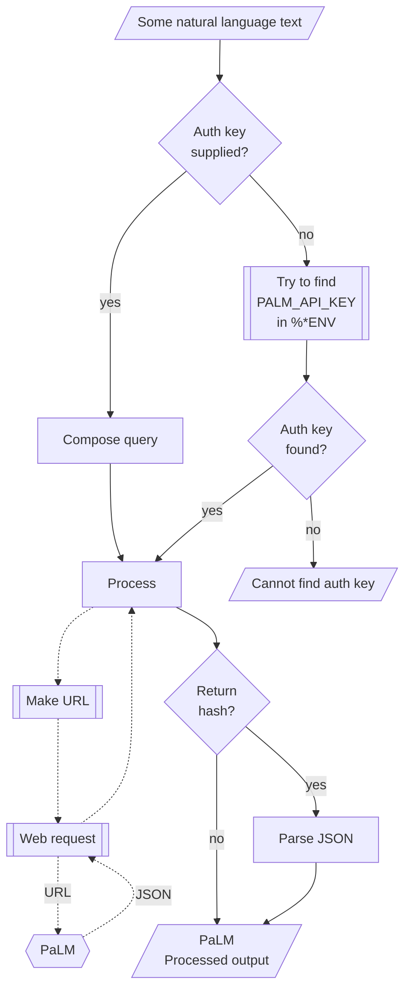

# WWW::PaLM Raku package

Raku package for connecting with [PaLM (Pathways Language Model)](https://blog.google/technology/ai/google-palm-2-ai-large-language-model/).

The design and implementation of the package closes follows that of 
["WWW::OpenAI"](https://raku.land/zef:antononcube/WWW::OpenAI), [AAp1];

## Installation 

From [Zef ecosystem](https://raku.land):

```
zef install WWW::PaLM
```

From GitHub:

```
zef install https://github.com/antononcube/Raku-WWW-PaLM
```

-----

## Usage examples

Show models:

```perl6
use WWW::PaLM;

palm-models()
```

Show text generation:

```perl6
.say for palm-generate-text('what is the population in Brazil?', format => 'values', n => 3);
```


Show message generation:

```perl6
.say for palm-generate-message('Who wrote the book "Dune"?');
```

Show text embeddings:

```perl6
my @vecs = palm-embed-text(["say something nice!",
                            "shout something bad!",
                            "wher is the best coffee made?"],
        format => 'values');

.say for @vecs;
```


-------

## Command Line Interface

### Maker suite access

The package provides a Command Line Interface (CLI) script:

```shell
palm-prompt --help
```

**Remark:** When the authorization key argument "auth-key" is specified set to "Whatever"
then `palm-prompt` attempts to use the env variable `PALM_API_KEY`.


--------

## Mermaid diagram

The following flowchart corresponds to the steps in the package function `palm-prompt`:



------

## TODO

- [ ] TODO Implement moderations.
- [X] DONE Comparison with "WWW::OpenAI", [AAp1].
  - The comparison is done via workflows with "LLM::Functions", [AAp3]
- [X] DONE Hook-up finding textual answers implemented in "WWW::OpenAI", [AAp1].
  - There is a dedicated package for this now -- see "ML::FindTextualAnswer", [AAp4]. 

------

## References


### Articles

[AA1] Anton Antonov,
["Workflows with LLM functions"](https://rakuforprediction.wordpress.com/2023/08/01/workflows-with-llm-functions/),
(2023),
[RakuForPredictions at WordPress](https://rakuforprediction.wordpress.com).

[AA2] Anton Antonov,
["Number guessing games: PaLM vs ChatGPT"](https://rakuforprediction.wordpress.com/2023/08/06/number-guessing-games-palm-vs-chatgpt/)
(2023),
[RakuForPredictions at WordPress](https://rakuforprediction.wordpress.com).

[ZG1] Zoubin Ghahramani,
["Introducing PaLM 2"](https://blog.google/technology/ai/google-palm-2-ai-large-language-model/),
(2023),
[Google Official Blog on AI](https://blog.google/technology/ai/).

### Packages, platforms

[AAp1] Anton Antonov,
[WWW::OpenAI Raku package](https://github.com/antononcube/Raku-WWW-OpenAI),
(2023),
[GitHub/antononcube](https://github.com/antononcube).

[AAp2] Anton Antonov,
[Lingua::Translation::DeepL Raku package](https://github.com/antononcube/Raku-Lingua-Translation-DeepL),
(2022),
[GitHub/antononcube](https://github.com/antononcube).

[AAp3] Anton Antonov,
[LLM::Functions Raku package](https://github.com/antononcube/Raku-LLM-Functions),
(2023),
[GitHub/antononcube](https://github.com/antononcube).

[AAp4] Anton Antonov,
[ML::FindTextualAnswer Raku package](https://github.com/antononcube/Raku-ML-FindTextualAnswer),
(2023),
[GitHub/antononcube](https://github.com/antononcube).

[OAI1] OpenAI Platform, [OpenAI platform](https://platform.openai.com/).
