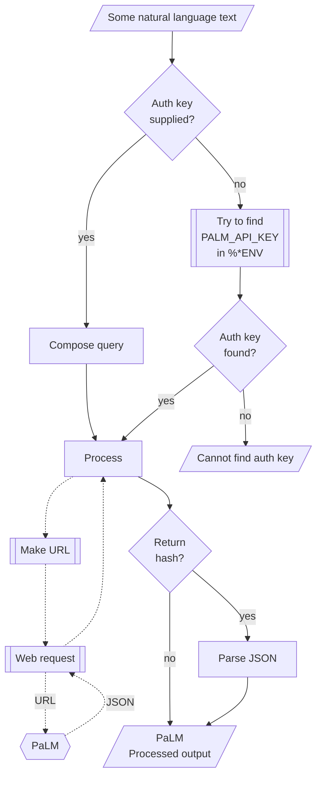

# WWW::PaLM Raku package

Raku package for connecting with [PaLM (Pathways Language Model)](https://blog.google/technology/ai/google-palm-2-ai-large-language-model/).

The design and implementation of the package closes follows that of 
["WWW::OpenAI"](https://raku.land/zef:antononcube/WWW::OpenAI), [AAp1];

## Installation 

From [Zef ecosystem](https://raku.land):

```
zef install WWW::PaLM
```

From GitHub:

```
zef install https://github.com/antononcube/Raku-WWW-PaLM
```

-----

## Usage examples

Show models:

```perl6
use WWW::PaLM;

palm-models()
```
```
# (models/chat-bison-001 models/text-bison-001 models/embedding-gecko-001)
```

Show text generation:

```perl6
.say for palm-generate-text('what is the population in Brazil?', format => 'values', n => 3);
```
```
# 211,768,929
# 213,317,639
# 212,609,039
```


Show message generation:

```perl6
.say for palm-generate-message('Who wrote the book "Dune"?');
```
```
# {candidates => [{author => 1, content => Frank Herbert wrote the book "Dune". It was first published in 1965 and is considered one of the greatest science fiction novels of all time. The book tells the story of Paul Atreides, a young man who is thrust into a war for control of the desert planet Arrakis. Dune has been adapted into a film, a television series, and a number of video games.}], messages => [{author => 0, content => Who wrote the book "Dune"?}]}
```

Show text embeddings:

```perl6
my @vecs = palm-embed-text(["say something nice!",
                            "shout something bad!",
                            "wher is the best coffee made?"],
        format => 'values');

.say for @vecs;
```
```
# [0.0011238843 -0.040586308 -0.013174802 0.015497498 0.04383781 0.012527679 0.017876161 0.031339817 -0.0042566974 -0.024129443 -0.023050068 -0.015625203 0.03501345 -0.006033779 -0.011984176 -0.033368077 -0.040653296 0.022117265 -0.02034076 -0.040752005 -0.12748374 0.029760985 0.00084632 -0.017502416 -0.03893842 -0.07151896 0.0609997 -0.0046266303 -0.044301335 -0.022592714 0.023920823 0.0020489343 -0.0048049283 -0.038431767 0.007275116 0.018562535 0.017131427 -0.00043720857 0.02810143 0.053296003 0.031831037 -0.067091785 0.015640317 -0.0036152988 -0.04691379 -0.044070054 -0.022364588 -0.0083763655 -0.0490714 -0.007302964 0.006516001 -0.004685413 0.03979989 -0.014196505 0.01065721 -0.0073698894 -0.036348466 -0.008763353 -0.01892632 -0.054501593 0.032021806 -0.007242739 0.0220439 -0.07687204 -0.0740849 0.01748987 -0.027381063 -0.015533608 -0.013165218 -0.04867313 0.041797243 0.017989235 -0.00982055 0.03691631 0.010164966 -0.03985747 0.024958102 0.015761184 0.02152081 -0.06986678 -0.012039569 0.00056548475 -0.030969337 -0.07435745 -0.028182292 0.012739926 0.042157806 0.023305222 -0.03230193 -0.0033747193 -0.061240233 0.021881713 0.009969781 -0.010255637 -0.0049942187 -0.034989387 0.020215971 -0.020086009 0.0010875552 0.017283859 ...]
# [0.008541122 -0.024862545 5.7058678e-05 0.0038867046 0.067829944 0.021747978 -0.029083902 -0.004656434 -0.012782786 -0.018360043 -0.019952606 0.007747536 -0.0056520714 -0.038842484 0.0144888265 -0.028959233 -0.034373183 0.0086536445 0.0030540912 0.005582053 -0.123638585 0.04185863 0.009929637 0.017287828 -0.018644271 -0.08450658 -0.014902289 -0.05526195 -0.020689102 -0.0024103096 0.019860586 0.024158986 -0.05455204 -0.01493725 0.0006892038 0.00323405 -0.0006728824 -0.010576684 -0.014293131 0.038979508 0.01347389 -0.050580844 0.004814549 -0.031785876 -0.017129553 -0.013408159 -0.019374503 0.008474182 0.0013470884 -0.01079351 -0.011820318 0.002939847 0.019571697 0.030853825 0.013096097 -0.015389974 -0.017276747 -0.0005738943 -0.029613884 -0.035326067 0.002852012 0.016189976 0.025315559 -0.07327017 -0.039907347 0.03896169 -0.050800353 -0.039951827 0.0016103057 -0.06276334 0.03115886 0.011537878 -0.034277618 0.015627442 0.020582594 -0.040219635 0.011975396 0.037462063 0.06526648 -0.068473086 -0.014561573 0.005528434 -0.0057561444 -0.0419415 -0.007748433 0.012975432 0.01270717 0.046910107 -0.038431607 -0.0022757803 -0.08964604 0.020557715 0.017819826 0.0076504718 -0.053408835 0.012460911 -0.021491397 -0.02011912 -0.011796679 0.007281153 ...]
# [-0.04053886 -0.028188298 0.0223612 0.04598037 0.018368412 -0.04011965 0.042926013 0.021050882 -0.0094422195 -0.01832212 0.019964134 -0.0013347232 0.04966835 0.048276108 -0.005766044 -0.02433299 -0.040598087 -0.065635845 0.02209697 0.06312037 -0.085269 -0.012106354 0.0056219148 0.0030168872 -0.07658486 -0.048572473 -0.04269039 0.026315054 -0.006883465 -0.010089017 0.009539455 -0.030142343 -0.058066234 -0.03262922 -0.0018920723 0.062120162 -0.008042096 0.04948106 -0.00028861413 0.026026316 0.04703804 -0.012234463 0.058435097 -0.05434934 -0.049611546 -0.020385403 -0.05354296 0.07173936 0.014864944 -0.016838027 -0.024500856 0.008486 -0.0027952811 0.016175343 0.019633992 -0.0010128785 -0.03879283 -0.0091371685 0.041809056 -0.024545915 -0.009020674 0.018044515 0.025408195 -0.07722929 -0.04280286 -0.0077904514 -0.0014599559 -0.045557976 -0.009131333 -0.038542382 0.0069833044 0.043738525 -0.011051313 -0.010426432 -0.05466805 0.013140538 0.0069446876 -0.035760716 0.04011649 -0.066007614 -0.035028048 -0.03821088 -0.031489357 -0.06864613 0.0075672227 -0.0032299925 0.007995906 0.0020973664 -0.02571021 0.070727535 -0.09410694 -0.011029921 -0.010794598 -0.022694781 -0.041388575 0.038010556 -0.006979773 -0.034256544 -0.015818557 -0.0064860974 ...]
```


-------

## Command Line Interface

### Maker suite access

The package provides a Command Line Interface (CLI) script:

```shell
palm-prompt --help
```
```
# Usage:
#   palm-prompt [<words> ...] [--path=<Str>] [-n[=UInt]] [--mt|--max-output-tokens[=UInt]] [-m|--model=<Str>] [-t|--temperature[=Real]] [-a|--auth-key=<Str>] [--timeout[=UInt]] [-f|--format=<Str>] [--method=<Str>] -- Command given as a sequence of words.
#   
#     --path=<Str>                       Path, one of 'generateText', 'generateMessage', 'embedText', or 'models'. [default: 'generateText']
#     -n[=UInt]                          Number of completions or generations. [default: 1]
#     --mt|--max-output-tokens[=UInt]    The maximum number of tokens to generate in the completion. [default: 100]
#     -m|--model=<Str>                   Model. [default: 'Whatever']
#     -t|--temperature[=Real]            Temperature. [default: 0.7]
#     -a|--auth-key=<Str>                Authorization key (to use PaLM API.) [default: 'Whatever']
#     --timeout[=UInt]                   Timeout. [default: 10]
#     -f|--format=<Str>                  Format of the result; one of "json", "hash", "values", or "Whatever". [default: 'values']
#     --method=<Str>                     Method for the HTTP POST query; one of "tiny" or "curl". [default: 'tiny']
```

**Remark:** When the authorization key argument "auth-key" is specified set to "Whatever"
then `palm-prompt` attempts to use the env variable `PALM_API_KEY`.


--------

## Mermaid diagram

The following flowchart corresponds to the steps in the package function `palm-prompt`:



------

## TODO

- [ ] TODO Implement moderations.
- [X] DONE Comparison with "WWW::OpenAI", [AAp1].
  - The comparison is done via workflows with "LLM::Functions", [AAp3]
- [X] DONE Hook-up finding textual answers implemented in "WWW::OpenAI", [AAp1].
  - There is a dedicated package for this now -- see "ML::FindTextualAnswer", [AAp4]. 

------

## References


### Articles

[AA1] Anton Antonov,
["Workflows with LLM functions"](https://rakuforprediction.wordpress.com/2023/08/01/workflows-with-llm-functions/),
(2023),
[RakuForPredictions at WordPress](https://rakuforprediction.wordpress.com).

[AA2] Anton Antonov,
["Number guessing games: PaLM vs ChatGPT"](https://rakuforprediction.wordpress.com/2023/08/06/number-guessing-games-palm-vs-chatgpt/)
(2023),
[RakuForPredictions at WordPress](https://rakuforprediction.wordpress.com).

[ZG1] Zoubin Ghahramani,
["Introducing PaLM 2"](https://blog.google/technology/ai/google-palm-2-ai-large-language-model/),
(2023),
[Google Official Blog on AI](https://blog.google/technology/ai/).

### Packages, platforms

[AAp1] Anton Antonov,
[WWW::OpenAI Raku package](https://github.com/antononcube/Raku-WWW-OpenAI),
(2023),
[GitHub/antononcube](https://github.com/antononcube).

[AAp2] Anton Antonov,
[Lingua::Translation::DeepL Raku package](https://github.com/antononcube/Raku-Lingua-Translation-DeepL),
(2022),
[GitHub/antononcube](https://github.com/antononcube).

[AAp3] Anton Antonov,
[LLM::Functions Raku package](https://github.com/antononcube/Raku-LLM-Functions),
(2023),
[GitHub/antononcube](https://github.com/antononcube).

[AAp4] Anton Antonov,
[ML::FindTextualAnswer Raku package](https://github.com/antononcube/Raku-ML-FindTextualAnswer),
(2023),
[GitHub/antononcube](https://github.com/antononcube).

[OAI1] OpenAI Platform, [OpenAI platform](https://platform.openai.com/).
